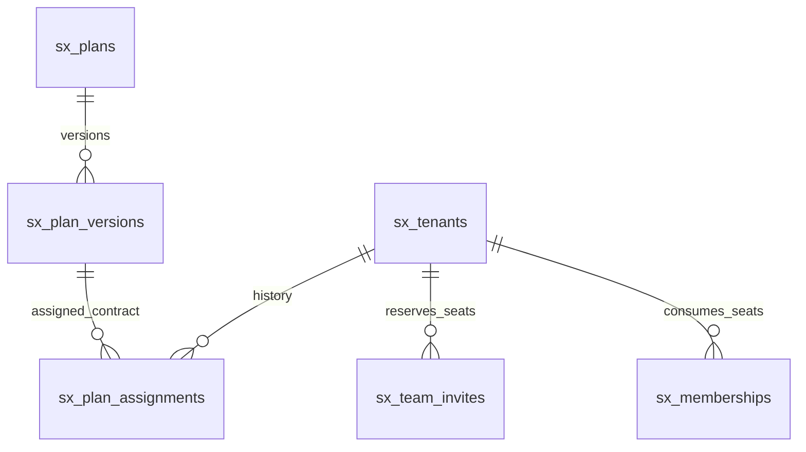

# Versioned plans and reserved team seats

TC35 contract increment; prerequisites for TC06/TC07. SQL and transaction services are locally verified. No staff plan screen, public login/invite acceptance, provider send, billing checkout or production API is enabled by this increment.

## Existing module is the delivery destination

Upgrade the current Manage Plans screen at /admin?page=manage-plans and current Manage Users plan assignment at /admin?page=manage-users. Preserve /api/admin/add_plan, edit_plan, get_plans and update_plan compatibility through reviewed adapters and map existing plan IDs/fields and assigned-user history to the versioned contract. Do not ship a second plan catalogue or standalone administration panel at /admin/plans. Owner/staff access belongs to the existing /admin panel; tenant additions belong to the existing /user panel. Test-only plan handlers and screens are not evidence of this integration.

## Storage

Migration `20261001_platform_plans.sql` adds `sx_plans`, `sx_plan_versions`, `sx_plan_assignments` and `sx_team_invites`.

A plan is a named catalog item. Its version owns category/version, capability keys and seat ceilings. Publishing freezes that version through service enforcement. A new draft on the same catalog item takes the next version under a catalog-row lock. Published rows must additionally be protected by restricted application DB privileges when the production data access layer is completed; this migration does not install SQL triggers or claim to defend against arbitrary privileged SQL.

Assignments reference a published version and store exact tenant seat limits, activation/expiry and lifecycle status. The database allows at most one current assignment per tenant; replacements preserve old rows as `superseded`. A generated current-tenant key covers trial/active/grace/suspended. An assignment with past expiry is read as `expired` even before a scheduler transitions its persisted status. Superseding an assignment is not a refund, cancellation of billing or deletion of historical evidence.

Invites reserve a non-owner seat and normalized email. Unique `(tenant,request_key)` handles retries; unique pending email prevents duplicate active invitations. Email and role must match when reusing a request key, otherwise `IDEMPOTENCY_CONFLICT`. No invitation bearer token or acceptance link exists yet. These rows are reservation records, not evidence of delivery or active accounts. Terminal invite rows remain in history; a new invitation uses a new request key.

## Trusted service interfaces

`modules/platform/plans.js` accepts an exclusively owned mysql2 connection and a server-derived authenticated context. Never use the preview role picker or a request JSON context as authority. The caller must reload the canonical session, enforce credential/revocation/expiry and CSRF, and release its connection after the service returns. Services own their transaction and must not be nested inside another transaction on that connection. Deadlock retry, where needed, must repeat the entire validated transaction with bounded attempts; never replay a partial mutation.

| Function | Permission | Input/result |
| --- | --- | --- |
| createDraft | platform `plans.draft` with MFA | Name for new catalog, optional existing planId, categoryKey/version, capabilities, roleLimits; returns id/planId/version/revision/status |
| updateDraft | platform `plans.draft` with MFA | Version UUID, expected revision, replacement definition; published version rejects edits; returns next revision |
| publish | platform `plans.publish` with MFA and recent authentication | Version UUID and expected revision; validates stored definition; returns published next revision |
| assign | platform `plans.assign` with MFA | Tenant/version UUIDs, roleLimits, status active/trial, integer durationDays 1–3650; returns new assignment |
| previewAssignment | platform `plans.assign` with MFA | Tenant/version UUIDs and proposed limits; returns current/proposed limits, usage, added/removed capabilities and role-specific blockers; previewOnly:true, no mutation |
| loadEntitlements | internal scoped lookup | Tenant UUID; returns assignmentId/status/roleLimits/capabilities/categoryKey/categoryVersion or null |
| reserveInvite | tenant `team.invite` and `team.members` capability | requestKey UUID, email and role accountant/manager/agent; returns id/status/repeated; new result says deliveryQueued:false |

Plan definition accepts only the deployed training-center manifest version and its known capability keys, without duplicates. All four role limits are required integers from 0 to 10,000; owner must equal one. Seven agent seats is the desired first release configuration, not a hardcoded global maximum. Tenant assignment limits may reduce but never exceed the published plan ceiling. Increasing above it requires another approved plan version; custom commercial overrides and pricing remain TC06 decisions/services.

Every successful create/edit/publish/assignment/reservation records an audit event in the same transaction. Audit changes omit invite email. The future request boundary must separately audit denied mutations without rolling that audit back with a rejected business transaction. No notification is sent by these services.

## Seat invariant and locking

For each role:

`used = active memberships + pending invitations whose expiry is in the future`

`new reservation allowed iff used < current assigned role limit`

Seat mutations and plan assignments lock the tenant row with `FOR UPDATE`. After obtaining it they expire stale pending invitations, reload usage and current entitlements, and apply the mutation. Invitation reservation also reloads the actor's membership and active identity from the database. Disabled identities and stale owner/manager grants cannot reserve a seat merely because an earlier request context allowed it. Database tenant/category state is used for the final policy check.

All eventual invite acceptance, reactivation, cancellation and membership creation must use the same tenant lock and invariant. Until those paths exist and are tested, TC07 remains incomplete. In particular, acceptance must consume the reserved slot rather than add a second slot, bind a verified recipient identity, never create an owner/platform membership, and survive concurrent acceptance/retry without duplicate accounts.

A limit reduction below used seats rejects `SEATS_IN_USE` and retains the previous assignment. Owner transfer is a distinct authenticated transaction, not an invite role. Grace/suspension/expiry continuity is TC36: current policy may allow grace operations but an expired or suspended assignment cannot reserve new seats. Verified financial settlement/report exports require their future continuity rules.

Assignment preview reads a consistent transactional snapshot without expiring records or changing the assignment. It does not reserve capacity or authorize a later assignment: confirmation obtains the tenant lock and repeats all checks against current usage. Staff screens must show removed capabilities explicitly and cannot treat a prior canAssign result as a guarantee.

## Errors and future route mapping

Bounded service codes: PERMISSION_DENIED, IDENTITY_REQUIRED, INVALID_ID, INVALID_ROLE_LIMITS, ONE_OWNER_REQUIRED, CATEGORY_UNAVAILABLE, INVALID_CAPABILITIES, INVALID_PLAN_NAME, INVALID_REVISION, PLAN_NOT_FOUND, PUBLISHED_PLAN_IMMUTABLE, STALE_REVISION, TENANT_NOT_FOUND, ACCOUNT_INACTIVE, PUBLISHED_PLAN_REQUIRED, PLAN_LIMIT_EXCEEDED, SEATS_IN_USE, INVALID_DURATION, INVALID_ASSIGNMENT_STATUS, INVALID_INVITE_ROLE, INVALID_EMAIL, FEATURE_UNAVAILABLE, IDEMPOTENCY_CONFLICT, SEAT_LIMIT_EXCEEDED, MEMBERSHIP_EXISTS, INVITE_ALREADY_PENDING. The future HTTP boundary must map these to documented 400/401/403/404/409 outcomes, mask foreign resources and redact database errors; these functions are not HTTP endpoints.

Required staff UI: searchable plan list with draft/published badges; full-page draft editor; category and capability selection; four labeled account limits; stale-edit recovery; publish confirmation showing impact; tenant assignment page with existing/pending seat counts and proposed differences. Owner team UI: members/invites tabs, role help, visible used/reserved/available seats, pending expiry/cancel/reinvite, accessible form validation and a useful limit-exceeded recovery action. No UI may show a reserved invitation as sent or accepted.

Before these screens ship: authenticated shared login/MFA, canonical request context middleware, full route/error OpenAPI definitions, list/detail queries and safe response projections, actor/tenant audit views, invitation delivery/acceptance/recovery, seat-mutation locking across all legacy routes, and EN/AR phone/tablet/desktop acceptance. The global TC35 training/finance/event contract pack is still open.

## Verified evidence

`npm test`: 21 passing tests, including definition validation and existing foundation checks. `scripts/test-migrations-local.ps1`: separate loopback MariaDB and disposable synthetic database, five forward migrations; two distinct connections race for the final seventh agent seat. Tests prove published edit denial, stale revision rejection, assignment preservation after new versions, failed downgrade rollback, idempotent reservations/conflicting retry denial, expired reservation release, live actor disablement/role denial, expired subscription denial, and transactional audit counts. Customer data untouched and externalWrites=false.

## Existing catalogue contract bridge — 1 October 2026

The eighth migration `20261001_versioned_catalogue_bridge.sql` adds explicit one-to-one links from legacy plan IDs to the canonical catalogue, plus frozen commercial snapshots for each mapped version. It creates no plans, assigns no category to existing customers and performs no backfill. The existing catalogue remains the delivery destination; this is storage linking, not another customer-maintained catalogue.

`modules/platform/catalogue-bridge.js` supplies connection-owned `createDraft`, `list` and `publish` services. A trusted, reloaded canonical platform context with MFA is required. Draft/read/publication require plans.draft/plans.read/plans.publish; publication additionally requires recent authentication. Input includes the existing numeric `legacyPlanId`, canonical training-center definition/role limits and request UUID. It locks the actual catalogue row, validates its commercial fields, allocates a version under the mapped catalogue lock and stores exact ID/title/description/prices/duration/legacy flags/limits. Seven agents is an editable plan ceiling, not a global hardcoded limit.

Repeated matching create requests return the same version; different definitions or actors using that request fail. Concurrent attempts create one mapping/draft. Each successful change has a transactional audit event; an audit failure rolls back the draft and version counter. All participating tables must be InnoDB. Changes to the legacy row after draft capture reject publication with STALE_COMMERCIAL_CONTRACT; create/review a new draft. Published snapshots remain frozen after later catalogue edits. Existing canonical publish delegates mapped versions to this check; generic canonical draft creation on a mapped catalogue rejects MAPPED_PLAN_REQUIRES_CATALOGUE_DRAFT. This prevents a token-free alternate publication path from losing the reviewed commercial contract.

New bounded service codes include INVALID_LEGACY_PLAN_ID, INVALID_REQUEST_ID, IDEMPOTENCY_CONFLICT, LEGACY_PLAN_INVALID, CATALOGUE_STORAGE_NOT_READY, STALE_COMMERCIAL_CONTRACT and MAPPED_PLAN_REQUIRES_CATALOGUE_DRAFT. Existing canonical definition/revision/authorization errors still apply. These are service contracts, not newly activated HTTP routes. The next work is their MFA-protected adapter and controls inside existing Manage Plans, reviewed identity/ownership adoption, and atomic legacy/canonical assignment. Existing assigned snapshots are untouched; TC06 remains incomplete.
